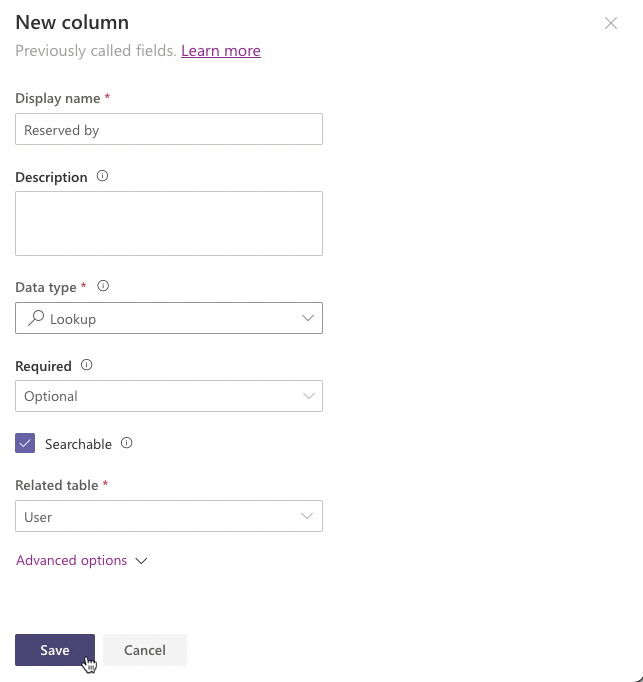
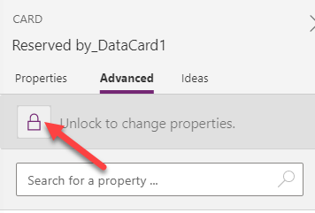
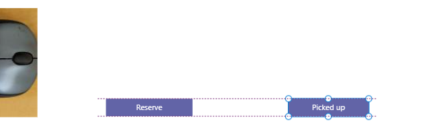
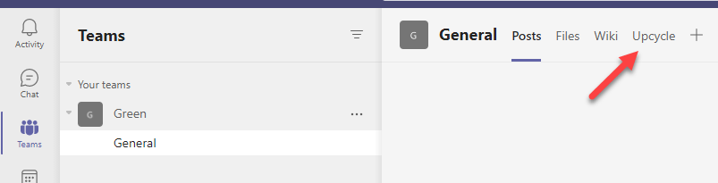

---
lab:
    title: 'Lab 03.1: Create apps in Teams'
    module: 'Module 03: Create a canvas app'
---

> **NOTE**
>
> Effective November 2020:
>
> - Common Data Service has been renamed to Microsoft Dataverse. [Learn more](https://aka.ms/PAuAppBlog)
> - Some terminology in Microsoft Dataverse has been updated. For example, *entity* is now *table* and *field* is now *column*. [Learn more](https://go.microsoft.com/fwlink/?linkid=2147247)
>

Lab 03.1: Create apps in Teams
=================================

## Scenario

It is not uncommon for organizations to accumulate unused computer peripherals, power cords and other electronics. Your organization is taking steps to reuse existing devices and computer peripherals before ordering new equipment.

You are asked to create an application where users can post devices they no longer need and browse through what their colleagues posted.

## Requirements

1)	Application must use Dataverse for Teams.
2)	Users should be able to create new items, edit items they created and see items created by other users.
3)	Items should be removed from the list if they are no longer available.
4)  Allow users to reserve an item.
5)  Allow user to mark item for pick up.
6)  If item is reserved, only reserved user should be able to mark item picked up.
7)  Users should be able to search items.

## What you will learn

1)	How to create an application using Dataverse for Teams.
2)	How to publish application.
3)	How to give other users permission to your application.

## Detailed steps

### Exercise 1: Get started with Microsoft Dataverse for Teams

In this exercise, you will create a new team and install Power Apps for Teams.

#### Task 1: Create team
In this task you will create a new team

1. Navigate to [Microsoft Teams](https://teams.microsoft.com).
2. Select **Teams**, click **Join or create a team** and click **Create Team**.


3. Select **From scratch**.
4. Select **Public**.
5. Enter **Green** for Team name and click **Create**.


6. Click **Skip** on **Add members to Green** screen.
7. You should now have a new team named **Green**.


8. Do not navigate away from this page.

#### Task 2: Install Power Apps
In this task you will install Power Apps for Teams.

1.  Click on the **... More added apps**, search for power apps and select **Power Apps**.


2.  Click **Add**.

3.  Right click on the Power Apps tab and select  **Pin**.


### Exercise 2: Create application
In this exercise, you will provision Dataverse for Teams by creating an application and you will also create a Dataverse table with columns.

#### Task 1: Create application
In this task, you will provision Dataverse for Teams by creating an application.
1. Navigate to [Microsoft Teams](https://teams.microsoft.com).

2. Select Power Apps and click **Start now**.


3. Select the **Green** team you created and click **Create**.
4. Wait until provisioning is complete.
5. Click **New > App**. 
6. Enter **Upcycle** for App name and click **Save**.
7. Do not navigate away from this page.

#### Task 2: Create table
In this task, you will create a table and columns.

1. Click **With data** and select **Create new table**.


2. Enter **Gadget** for Table name and click **Create**.
3. Click **+ New column**.
4. Enter **Description** for **Display name**, select **Text** for **Data type** (displayed as **Single line of text**), and click to expand the **Advanced options** section.


5. Change the **Maximum character count** to **500** and click **Save**.
6. Click **+ New column** again.
7. Enter **Availability** for Name, select **Choice** for Type, and click **+ New choice** under **Sync this choice with** dropdown box. That will open a window to create a global choice to sync with.
8. Enter **Availability** for **Display name**.
9. Enter **Available** for the first choice and click **+ New choice**.
10. Enter **Reserved** for the second choice and click **+ New choice**.
11. Enter **Picked up** for the third choice and click **Save**.


12. Select **Availability** in **Sync this choice with**.
13. Select **Available** for **Default choice** and click **Save**.


8.  Your table screen should now look like the image below.
    
9.  Close the table editor by clicking **Close** button.
10.  Do not navigate away from this page.


#### Task 3: Add columns
In this task, you will add new columns to the table.

1. Select the **Home** tab and click **See more**.


2. Click to open the **Gadget** table.
3. Click  **+ New > Column** menu.
4. Enter **Location** for **Display name**, select **Text** for **Data type** (displayed as **Single line of text**), select **Business required** for **Required** and click **Save**.


5. Click **+ New > Column**.
6. Enter **Photo** for **Display name**, select **File > Image** for **Data type**, check the **Primary image** checkbox and click **Save**.


7.  Click **+ New > Column**.
8.  Enter **Reserved by** for Display name, select **Lookup** for Data type, select **User** for Related table and click **Save**.




#### Task 4: Edit the application
In this task, you will edit the application by filters for gadgets that are available and edit the form.

1. Select the **Home** tab and click to open the **Upcycle** application you created.
2. Select **Screen1**. If the screen already contains the form, move to the next step, otherwise click **With data** and select **Gadgets** table under **Current environment**. That will create the screen elements including the form.
3. Make sure **RightContainer1** is expanded and select the **EditForm1** control from tree view.


3. Go to the **Properties** pane and click **Edit fields**


4. Click on the **+ Add field** button.
5. If any of the fields below does not exist on the EditForm control, click on the **+ Add field** butto, select the missing field and click **Add**.
   - **Name**
   - **Description**
   - **Availability**
   - **Location**
   - **Reserved by**
   - **Photo**


6. Remove any extra fields and close the **Fields** pane. Your form should only have **Name, Description, Availability, Location, Reserved By and Photo** columns.
7. Change **Columns** for **Snap to columns** to **1**.


8. Select the **Photo** inside the canvas and change **Width** to **400**.


9.  Expand the form and select the **Reserved by** data card.


10.  Go to the **Properties** pane, select the **Advanced** tab and click **Unlock**.



11.   Search for display and change the **DisplayMode** value to **DisplayMode.View**.


12.  Select the **Browse gallery** under **LeftContainer** in the treeview.
13. Select **Items** on the formula bar and replace the value with formula below. This formula will filter the gadgets to show only the available gadgets

    ```Filter(Gadgets, Availability <> [@Availability].'Picked up')```


14.  Select the **Image** inside the gallery.


15.  Go to the formula bar and varify that the value of the Image is set to the formula below.

```ThisItem.Photo```

16.   Select the **Data** tab (database icon) in the left navigation, click on the **...More actions** button of the **Gadgets** table and select **Refresh**.


17.  Click **Save** and wait for the app to be saved.
18.  Click **Preview the app**.
19.  Click **+ New record**.


20.  Fill out the form and click **Tap or click to add a picture**.


21.  Provide your own photo or select one from the lab resources folder.
22.  Click **Save**.


23.  Add few more items.
24.  Your app should now look like the image below. Close the preview.


25.  Click X to close the app.


#### Task 5: Update Dataverse rows
In this task, you will add buttons that will let users reserve and/or pick up item, you will also update the rows in Dataverse as reserved or picked up.

1. Select **App** from the Tree view and set the **OnStart** property to the formula below. This formula will create a variable named CurrentUser and set its value to the first user that matches the logged in user's email.

```Set(CurrentUser, First(Filter(Users, 'Primary Email' = User().Email)))```


2. Select App, select **ellipsis** and select **Run OnStart**.
3. Select the **RightContainer**.


3. Click on the **+** Insert button and select **Button**.


4. Select the **Tree view**, double click on the button you just added and rename it **Reserve Button**.


5. Set the **Text** value of the Reserve Button to **Reserve**.
6. Move the Reserve Button and place it next to the Image.


7. Set the **DisplayMode** value of the Reserve Button to the formula below. This formula will disable the button if the selected item is not available.

```If(BrowseGallery1.Selected.Availability = [@Availability].Available, DisplayMode.Edit, DisplayMode.Disabled)```

8. Set the **OnSelect** value of the Reserve Button to the formula below. This formula will update the selected record by setting the reserved by value to the current user and the availability value to reserved.

```Patch(Gadgets, BrowseGallery1.Selected, {Availability: [@Availability].Reserved, 'Reserved by': CurrentUser})```

9. Set the **Visible** value of the Reserve Button to the formula below. This formula will hide the button if the user is creating a new record.

```If(EditForm1.Mode = FormMode.View, true, false)```

10. Select the **RightContainer** again.
11. Click on the **+** Insert button and select **Button** again.
12. Select the **Tree view**, double click on the button you just added and rename it **Picked Up Button**.


12. Set the **Text** value of the Reserve Button to **Picked up**.
13. Adjust the width and move the Picked Up Button and place it to the right of the Reserve Button.



14. Set the **DisplayMode** value of the Picked Up Button to the formula below. This formula will disable the button if the selected item is reserved and the reserved by user is not the current user.

 ```If(BrowseGallery1.Selected.Availability = [@Availability].Reserved And BrowseGallery1.Selected.'Reserved by'.'Primary Email' <> CurrentUser.'Primary Email', DisplayMode.Disabled, DisplayMode.Edit)```

15. Set the **OnSelect** value of the Picked Up Button to the formula below. This formula will update the selected record by setting the reserved by value to the current user and the availability value to picked up. The second formula will select the first item of the gallery.

```Patch(Gadgets, BrowseGallery1.Selected, {Availability: [@Availability].'Picked up', 'Reserved by': CurrentUser});Select(BrowseGallery1,1)```

16. Set the **Visible** value of the Picked Up Button to the formula below. This formula will hide the button if the user is creating a new record.

```If(EditForm1.Mode = FormMode.View, true, false)```

 17. Click **Save** to save your changes.
 18. Do not navigate away from this page.


#### Task 6: Add search
In this task, you will add search capability to your application.

1. Select the **RightContainer**.
2. Click on the **+ Insert** menu, select **Icons** and then select **+ Add**.
3. Place the icon above the form.


4. Select the icon, go to the **Properties** and select **Search** for Icon.


5. Click on the **+** Insert menu and select **Text box**.
6. Select the **Tree view**.
7. Select the text box you just added and rename it **Search box**.


8. Place the Search Box to the right of the icon.


9.  Select the **Search Box** and set **OnChange** value to the formula below. This formula will reset the gallery.

```Reset(BrowseGallery1)```

10. Select the **BrowseGallery** under **LeftContainer1** and change the **Items** formula to the formula below. The formula is incomplete, we will complete it in the next step.

```Filter(Search(Gadgets, 'Search Box'.Value, ), Availability <> [@Availability].'Picked up')```

11. Place your cursor after **'Search Box'.Value** and type name. You should see a suggestion with crxxx_name, select the suggested column.


12. Add comma after the name column you just selected and type **description** and select the suggested column again.


13. Your formula should now look like the image below. This formula will search the name and description columns of the gadgets table for whatever the user types in the text box and filter out the picked up items.


14.  Select the **Search Box**.
15.  Go to the formula bar and clear the **Value** text.


16.  Click **Save** to save your changes.

### Exercise 3: Test and publish application
In this exercise, you will test, publish and give colleagues permission to use the application.

#### Task 1: Test application
In this task, you will test the application.

1. Click on the **Preview** button.


2. The **Reserve** and **Picked up** button should be visible and enabled.
3. Search for cable. The gallery should show items that have the text **cable** in the name or description column.


4. Select one of the items, the **Reserved by** column value should be empty.
5. Click on the **Reserve** button.


6. The **Reserve** button should become disabled and the **reserved by** value will be set to your username. Click on the **Picked up** button.


7. The item should no longer show up on the gallery and the first item of the gallery should get selected.
8. Close the preview.
9. Do not navigate away from this page.


#### Task 2: Publish application
In this task, you will publish the application to Teams.

1. Click on the **Publish to Teams** button.


2. Click **Next**.
3. Click **+** add app as a tab.


4. Click **Save and close**
5. Select **Teams** and select the new **Upcycle** tab.



6. The app should load. If the app is not loaded, refresh the page.


7. Test the application in Teams and make sure it behaves as you expected.


#### Task 3: Give permissions
In this task, you will give your colleagues permission to create new items, edit items they created, delete items they created and read items created by other people.

1. Select **Power Apps** and click on the **See more** link.


2. Click to open the **Gadget** table.
3. Click **Manage permissions**.


4. Select **Members**, select **Collaborate** permission and click **Save**


5. You may test the application with another user and see how it behaves.

