---
lab:
    title: 'Lab 03.2: Canvas app'
    module: 'Module 03: Create a canvas app'
---

> **NOTE**
>
> Effective November 2020:
> - Common Data Service has been renamed to Microsoft Dataverse. [Learn more](https://aka.ms/PAuAppBlog)
> - Some terminology in Microsoft Dataverse has been updated. For example, *entity* is now *table* and *field* is now *column*. [Learn more](https://go.microsoft.com/fwlink/?linkid=2147247)
>

# Lab 03.2: Canvas app

In this module you will design and build a canvas app for the company employees to submit problem reports.

## What you will learn

  - Import and use a pre-built component library
  - Create a Power Apps canvas app
  - Connect to a data source
  - Filter data
  - Create data rows
  - Use images with data rows
  - Embed canvas Power App into Microsoft Teams

## High-level lab steps

  - Import company components
  - Create app and layout main screen (including list of my items)
  - Submit New Report
  - Test
  - Embed canvas app in Microsoft Teams

## Prerequisites

* Must have completed **Lab 02.1: Data model and model-driven app**

## Detailed steps

  ### Exercise 1: Create canvas application

In this exercise, you will import a solution with shared components, create a view for the Problem Report table and create a canvas application.

#### Task 1: Import component library solution

In this task, you will import the shared components solution into your environment. This shared component library was built by another team at your company.

1.  Navigate to the [Power Apps maker portal](https://make.powerapps.com/) page and make sure you are in the correct environment.

2.  Select **Solutions** and click **Import Solution**.

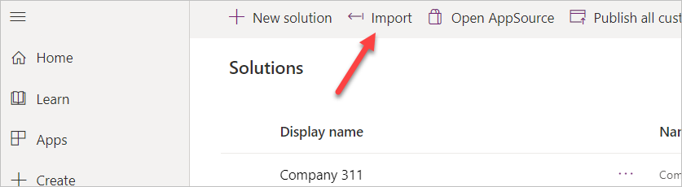

3.  Click **Browse**.

4.  Go to the course resources folder, select the **Shared components** solution, and click **Open**.

5.  Click **Next**.

6.  Click **Import** and wait for the import to complete.

7.  Click **Publish All Customizations** and wait for the publishing to complete.

8.  You should now see the **Shared Components** solution you imported. Click to open the **Shared Components** solution.

9. The solution should have one item in it. (**Lamna Healthcare Shared Components**)


> **IMPORTANT**
>
> There is an issue where importing the app as part of a solution may not add it to your components library. The following steps are designed to resolve the issue.

10. Navigate to **Apps**, Select the **Lamna Healthcare Shared Components App**.
11. Click the **Edit Icon** to edit the app.

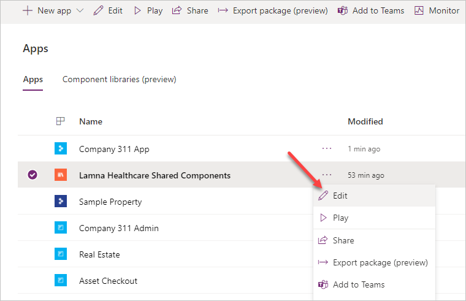

12. Select your **Region/Country** and click **Get started** if prompted.
    
> **NOTE**
>
>When the app is open in Edit mode, move on to next step, as the Preloader component shows a Loading icon but it is not actually waiting for something to load.
13. After the app opens, click **File** > **Save As**.
14. Change app name to **Lamna Healthcare Share Components A** and click **Save**.


14. Click **OK** when prompted to save as a new library.
15. Close the **Lamna Healthcare Shared Components** tab in your browser.

#### Task 2: Create view

In this task, you will create a view that will show the current user’s problem reports. Later you will use this view with the filter function in the canvas app.

1.  Navigate to the [Power Apps maker portal](https://make.powerapps.com/) page and make sure you are in the correct environment.

2.  Select **Solutions** and click to open the **Company 311** solution.

3.  Locate and click to open the **Problem Report** table.

4.  Select **Views** in the treeview navigation and click to open the **Active Problem Reports** view.

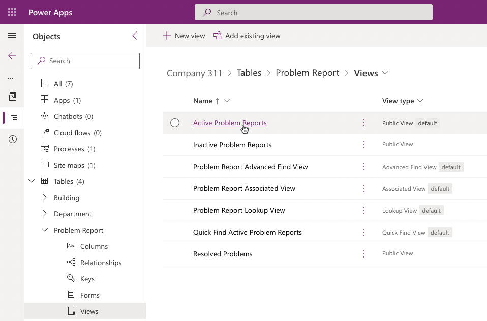

5.  Click **Edit filters**.

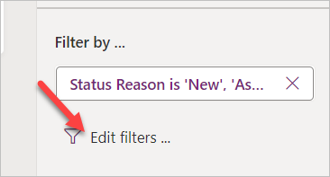

6.  Change the filter to **Created By Equals current user** and click **OK**.

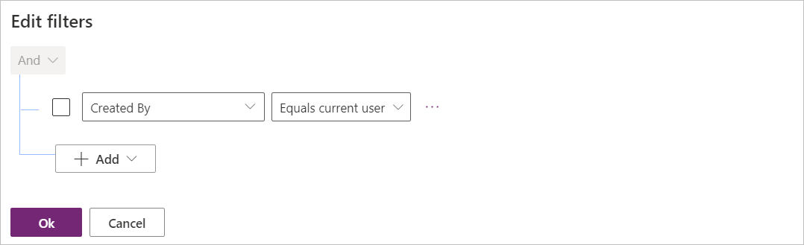

7.  Click on the chevron button next to the Save button and select **Save As**.

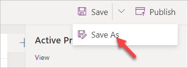

8.  Enter **My Reports** for **Name** and click **Save**.

9.  Click **Publish** and wait for the publishing to complete.

10. Click on the **<- Back** button on the command bar to go back to the Problem Report table details.

#### Task 3: Create the user application

In this task, you will create a canvas application using the phone form factor.

1.  Navigate to the [Power Apps maker portal](https://make.powerapps.com/) page and make sure you are in the correct environment.

2.  Select **Solutions** and click to open the **Company 311** solution.

3.  Click **+ New | App |Canvas app**.

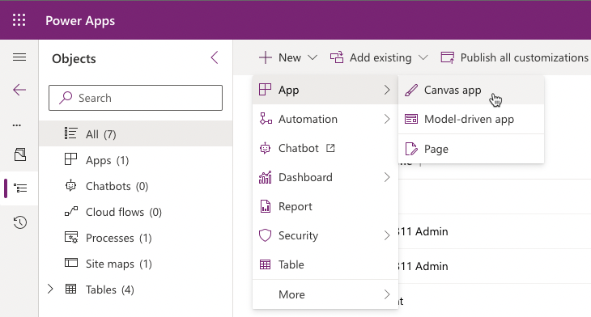

4.  Enter **Company 311 Phone App**, select **Phone** for format, and click **Create**.

5.  Select **Skip**.

6.  Go to the Tree view and double click **Screen1**.

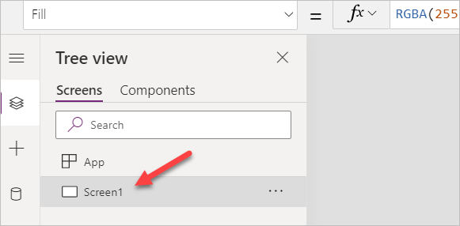

10. Rename the screen **Main Screen**. It’s always a good idea to give your screens a meaningful name.


11. Select the **Main Screen** and select on the **+ Insert** from the left navigation pane .

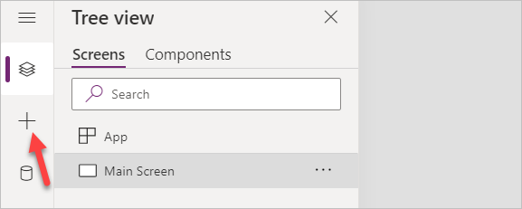

12. Select **Get more Components**.


13.  Expand the **Lamna Healthcare Shared Components A** Library, select **Header** and **Tab Control**, and then click **Import**.

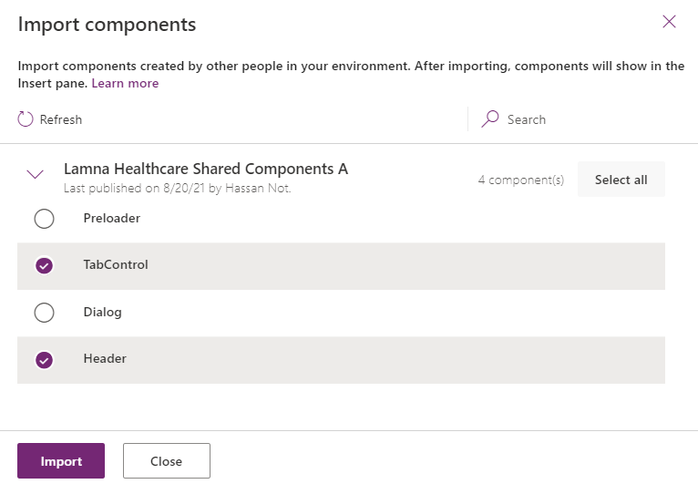


14.  Expand **Library components**, select **Header Control** and **Tab Control**. These are both components from the library you imported earlier in the lab.


15. Move the **Tab Control** to the bottom of the screen and the **Header Control** to the top of the screens.

16. Select the **Header Control** and change the **Text** value to **"Company 311".**

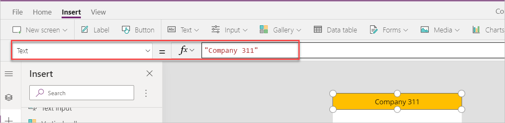

17. Set the **Height** of the **Header Control** to **75**.

    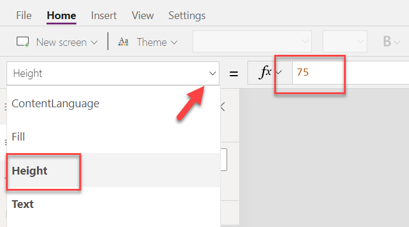

18. Right click on the Main Screen and select **Duplicate screen**.

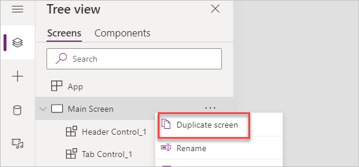

18. Rename the new screen **New Reports Screen**.

19. Select the **Tree view**, select **App** and change the **OnStart** value to the formula below. This formula will create a new variable named My Tabs and set it to a table of tab items.

```javascript
Set('My Tabs', Table( {
	Label: "My Reports",
	Screen: 'Main Screen',
	Icon: "",
	SelectedIcon:""
},
{
	Label: "New Report",
	Screen: 'New Reports Screen',
	Icon: "",
	SelectedIcon:""
}
))
```

> **IMPORTANT**
>
> When expressions are copied, the quotes and double quotes are sometimes replaced with their "smart" counterparts which are not valid in formulas. If you copy and paste the expression above, make sure the resulting formula does not contain any errors.     

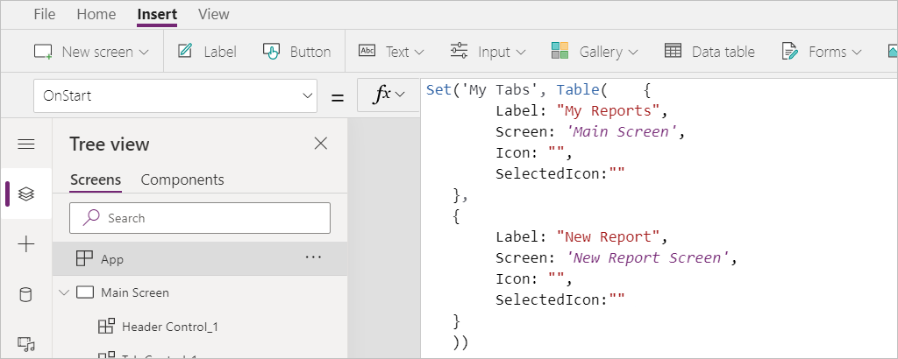

20. Select the **Tab Control** in the **Main Screen** and change the **Items** value to **‘My Tabs’**.

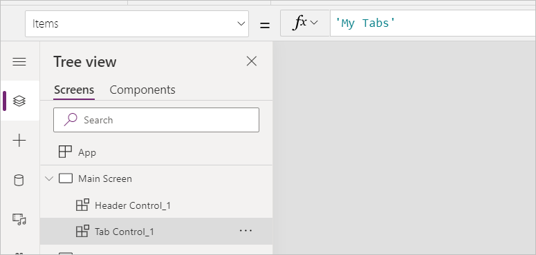

21. Change the **SelectedColor** value to **WhiteSmoke**.

22. Select the **Tab Control** inside the **New Report Screen** and set the Item value to **‘My Tabs’**.

23. Change the **SelectedColor** value to **WhiteSmoke**.

24. Click on the **…** button of the **App** and select **Run OnStart**.


25. Your tabs should now show the two tabs you added.


26. Click **File** and then click **Save**.
27. Click on the **<- Back** button.

28. Do not navigate away from this page.

### Exercise 2: My reports

In this exercise, you will add a gallery that will show reports created by the current logged in user.

#### Task 1: Add gallery

1.  Select the **Main Screen**, select **Insert** menu, then select **Vertical gallery**.

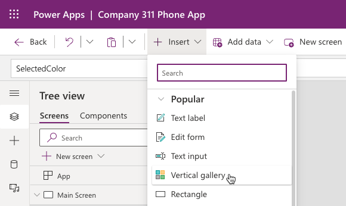

2.  Rename the new gallery **My Reports Gallery**.

3.  Resize and reposition **My Reports Gallery** and make sure the screen looks like the image below.

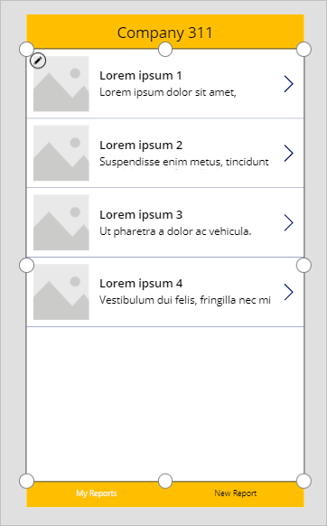

4.  Select **My Reports Gallery**, go to the **Properties** pane, and select **Problem Reports** for **Data Source**. If you do not see Problem Reports, click **See all tables** or **Search** for the table.


5.  Select the **My Reports** view you created for **View**.

6.  Click **Edit fields**.


7.  Change Subtitle1 to **statuscode**. This is the **Status Reason** column.


8.  Select **Image** control within the gallery. Set **Image** value to the formula below. This allows images to be displayed correctly when view is used as a source.

`LookUp('Problem Reports', 'Problem Report' = ThisItem.'Problem Report').Photo`

9. Click **Save** icon.
10. Do not navigate away from this page.

### Exercise 3: Allow removing reports

In this exercise, you will allow unassigned reports to be removed. This will allow users to easily remove any reports that were accidentally created.

#### Task 1: Allow remove

1.  Expand the **My Reports Gallery**.

2.  Select the **Icon** inside the **My Reports Gallery**.


3.  Change the **Icon** value to **Icon.Trash**.


4.  Change the **Visible** value to the formula below. This formula will hide the icon if the status reason is not New.

`If(ThisItem.'Status Reason' = 'Status Reason (Problem Reports)'.New, true, false)`

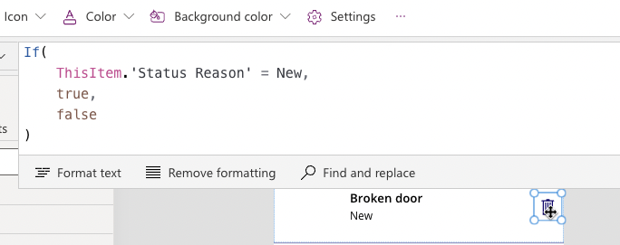

5.  Make sure you still have the icon selected. Change the **OnSelect** value to the formula below. This formula will remove item from the data source.

`Remove('Problem Reports', ThisItem)`

6.  Click **Save**.


### Exercise 4: Add new report

In this exercise, you will add a form to submit new problem reports.

#### Task 1: Add new report form

1.  Select the **New Reports Screen**, select **Insert**, then select **Edit Form**.

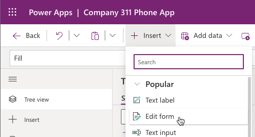

2.  Rename the form to **New Report Form**.

3.  Select **New Report Form**, go to the **Properties** pane, and select **Problem Report** for **Data source**.

4.  Click **Edit fields**.


5.  Remove the **Status Reason** Column.

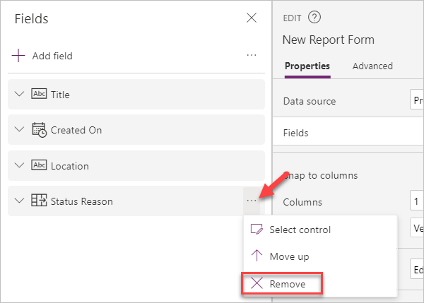

6.  Remove the **Created On** Column.

7.  Remove the **Location** Column.

8.  Click **+ Add field**.

9.  Select **Details**, **Building**, **Department**, and **Photo**, and then click **Add**.

10.  Resize and reposition the form so it takes most of the page and leave enough room for a button in the bottom.

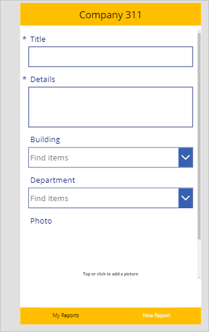

11. Select the **New Reports Screen**.

12. Select **Insert** then select **Button**.

13. Rename the button **Submit Report**.

14. Place the button below the form and make it stretch across the screen

15. Change the **Submit Report** button's **text** property to **Submit**.

16. Select the Submit Report button and change the **OnSelect** value to the formula below. This formula will create a new Row in the Problem Reports table.

`SubmitForm('New Report Form') `

17. Select the **New Report Form**.

18. Change the **OnSuccess** value to the formula below. This formula will show a notification after the new Row gets created and clear the form when the record creation is successful.

`Notify("Created new problem report row");NewForm('New Report Form')`

19. Select the **New Reports Screen**.

20. Set the **OnVisible** value to the formula below. This formula will create a new form when the screen becomes visible.

`NewForm('New Report Form')`

21. Click **Save**.
22. Click **Publish**.
23. Click **Publish this version** and wait for the publishing to complete.
25. Do not navigate away from this page.


### Exercise 5: Test the application

In this exercise, you will test the canvas application you created by submitting a problem report.

#### Task 1: Test application

1.  Select the **Main Screen** and click **Preview the app**.

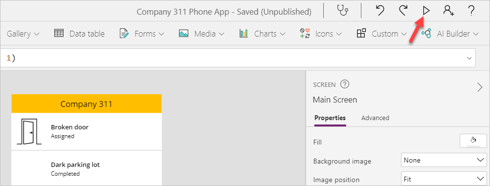

2.  The application should load, and the list should show all the reports you created.


3.  Select the **New Report** tab.

4.  The **New Report Form** should load. Fill out the form and click on the **Photo** Column.

5.  Select an image.

6.  Click **Submit**

7.  The Row should get created successfully and you should see the success message.

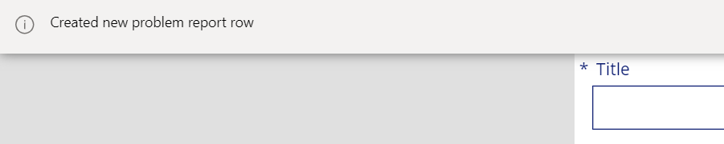

8.  Select the **My Reports** tab.

9.  You should see the new report you created. Click **Delete** to test the delete.


10. The Row should be deleted and removed from the list.


11. **Close** the preview.
12. **Close** the app studio by closing the browser tab.

### Exercise 6: Embed canvas app in Microsoft Teams

In this exercise, you will add the Company 311 Phone App that you created earlier, to Microsoft Teams as a way for staff to be able to log issues directly within Teams.

#### Task 1: Setup Company 311 Team

In this task, you will setup a **Microsoft Teams** team for the Lamna Healthcare Company, if you have not done so previously.

1.  Navigate to [Microsoft Teams](https://teams.microsoft.com) and sign in with the same credentials you have been using previously.

2.  Select **Use the web app instead** on the welcome screen.


3.  When the Microsoft Teams window opens, dismiss the welcome messages.

4.  Select **Teams**.
5.  On the bottom left corner, choose **Join or create a team**.

6.  Select **Create a team**.


6.  Press **From scratch**.

7.  Select **Public**.

8.  For the Team name enter **Company 311** and select **Create**.

9.  Select **Skip** adding members to Company 311.
10. Do not navigate away from this page.


#### Task 2: Add canvas app to Teams

1.  Select the **General** channel of the **Company 311** team.

2.  On the top of the page, press the **+** symbol to add a new tab.


4.  Search for **power** and select **Power Apps** from the results.

5.  Select **Add** to add Power Apps to Teams

6.  Select the **Company 311 Phone App** that you created earlier in this lab. 

> **IMPORTANT**
>
> If you do not see the app you need to go back to the app editor and publish the app

7. Select **Save**.

8. The **Company 311** app should now appear on a tab in Microsoft Teams.


