---
lab:
    title: 'Lab 02.1: Data model and model-driven app'
    module: 'Module 02: Create a model-driven app'
---

> **NOTE**
>
> Effective November 2020:
> - Common Data Service has been renamed to Microsoft Dataverse. [Learn more](https://aka.ms/PAuAppBlog)
> - Some terminology in Microsoft Dataverse has been updated. For example, *entity* is now *table* and *field* is now *column*. [Learn more](https://go.microsoft.com/fwlink/?linkid=2147247)
>

# Lab 02.1: Data model and model-driven app

In this lab you will be implementing the data model for the solution and building a model-driven app that will be used for fixing problems or managing the overall effort.

## What you will learn

  - Create Tables, Columns, and relationships

  - Create a model-driven app

  - Create a site map

  - Create and configure Table forms

  - Create and configure Table views

## High-level lab steps

  - Exercise 1 – Create publisher and solution  

  - Exercise 2 – Implement the data model 
    
      - Data Model 
        
          - Building 
          
          - Department 
          
          - Problem Report 

  - Exercise 3 – Configure forms and views 

  - Exercise 4 – Compose a basic model-driven app 

  - Exercise 5 – Input data and refine some views, import some problem reports 

## Detailed steps

### Exercise 1: Create publisher and solution

In this exercise, you will create a custom solution publisher and a solution. This solution will be used in all the labs for this course to keep all the components together.

#### Task 1: Create publisher and solution

1.  Navigate to the [Power Apps maker portal](https://make.powerapps.com/) and make sure you are in the practice environment you created.

2.  Select **Solutions** and click **+ New solution**.

3.  Enter **Company 311** for **Display name** and click.

4.  Click on the **+ New Publisher**, under the **Publisher** option.

5.  Enter **Lamna Healthcare** for **Display name**, **lamnahealthcare** for **Name**, **lh** for **Prefix**, **88186** for Choice value prefix, and click **Save**.

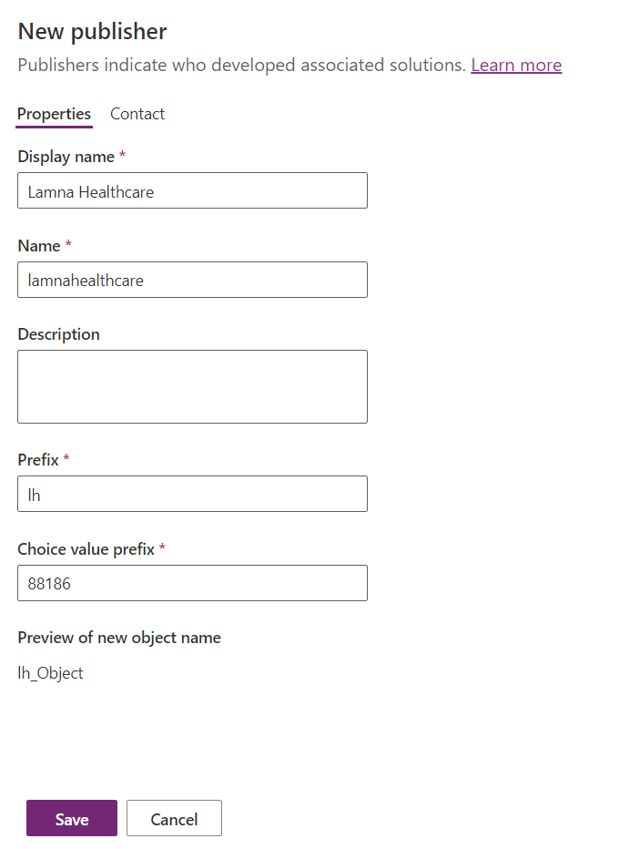

6.  Click on the **Publisher** dropdown and select the **Lamna Healthcare** publisher you created.

8.  Click **Create**.

9.  You should now see the solution you created in the solution list.

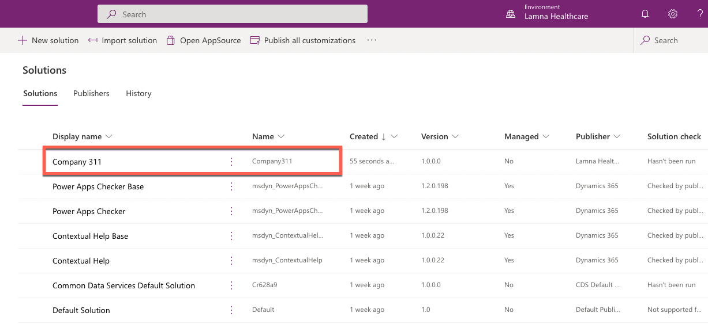

### Exercise 2: Implement data model

In this exercise, you will create Tables, Columns, and the Relationships you identified when you designed the data model for the Company 311 app.

#### Task 1: Create Tables

1.  In the [Power Apps maker portal](https://make.powerapps.com/) select **Solutions** and click to open the **Company 311** solution you created in Exercise 1.

2.  Click **+ New** and select **Table**.

3.  Enter **Building** for **Display name** and click **Save**.

4.  Select **All** in the solution navigation tree to display all solution components. 

5.  Click **+ New** and select **Table** again.

6.  Enter **Department** for **Display name** and click **Save**.

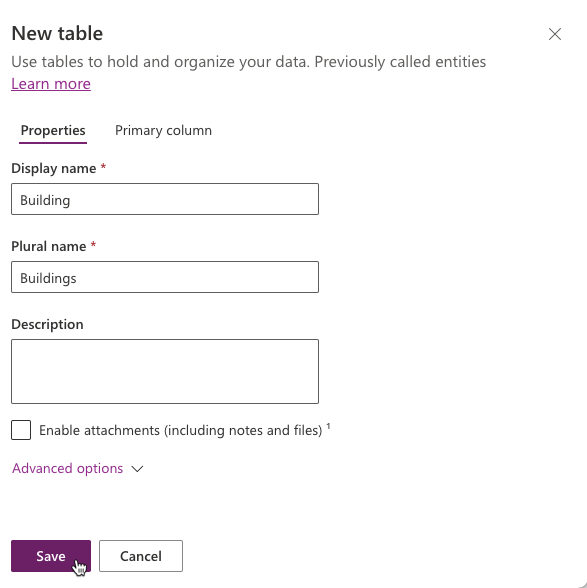

7.  Select **All** in the solution navigation tree to display all solution components. 
8.  Click **+ New** and select **Table** one more time.
9.  Enter **Problem Report** for **Display name**.

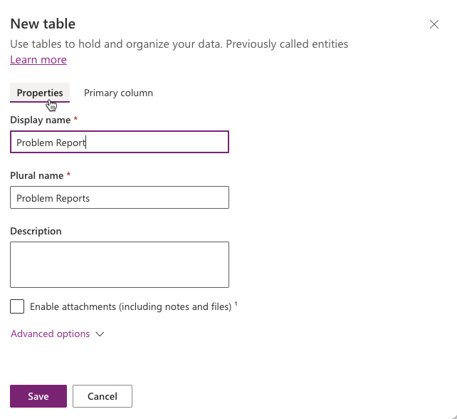

7.  Select **Primary Column** tab, enter **Title** for **Display name**.

10. Select **Properties** tab, click to expand **Advanced Options**, then scroll to **Rows in this table** section. 
10. Check the **Can be added to a queue** checkbox and click **Save**. 

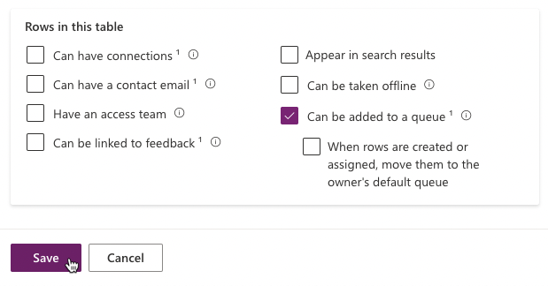

> **NOTE**
>
> Enabling queues for Problem Report table allows rows to be associated with one or more queues to help facilitate routing problem reports to the different departments. Once this option is enabled, it can't be turned off. 

12. Select **All** in the **Objects** navigation tree.  The tables you created should now be visible in the list view and in the tree navigation.

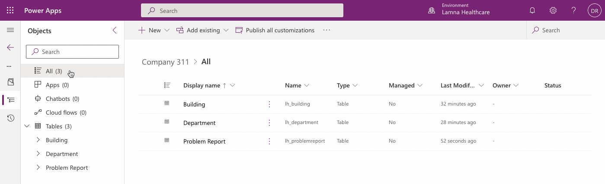

#### Task 2: Add Columns

In this task, you will add Columns to the Problem Report Table.

1.  Navigate to the [Power Apps maker portal](https://make.powerapps.com/) page and make sure you are in the correct environment.

2.  Select **Solutions** and click to open the **Company 311** solution you created in exercise 1.

3.  Click to open the **Problem Report** Table.

4.  There are many ways to add a new column in the table. For this lab purpose select the **+ New** menu, then select **Column** item.

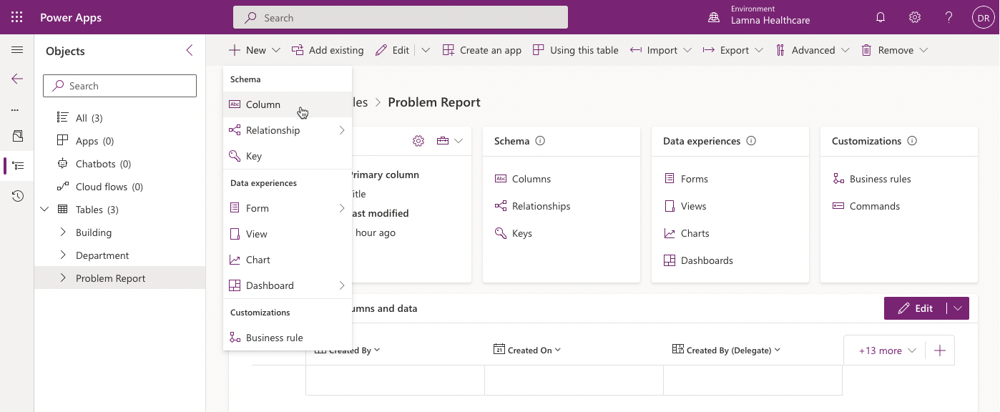

5.  Enter **Location** for **Display name**. Select **Text > Single line of text > Plain text** for **Data type**.

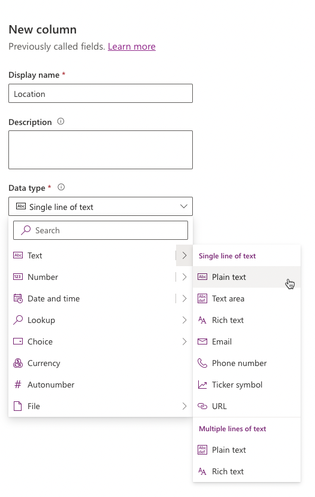

6. Expand **Advanced options** section, change **Maximum character count** to **150**, then click **Save**.

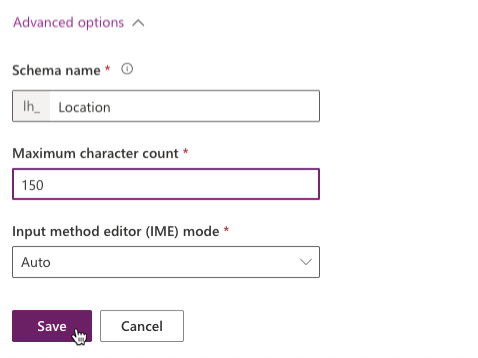

7.  Click **+ New > Column** in the top menu.

8.  Enter **Details** for **Display name**, select **Text > Multiline text > Plain Text** for **Data type**, make the Column **Business Required**, and click **Save**.

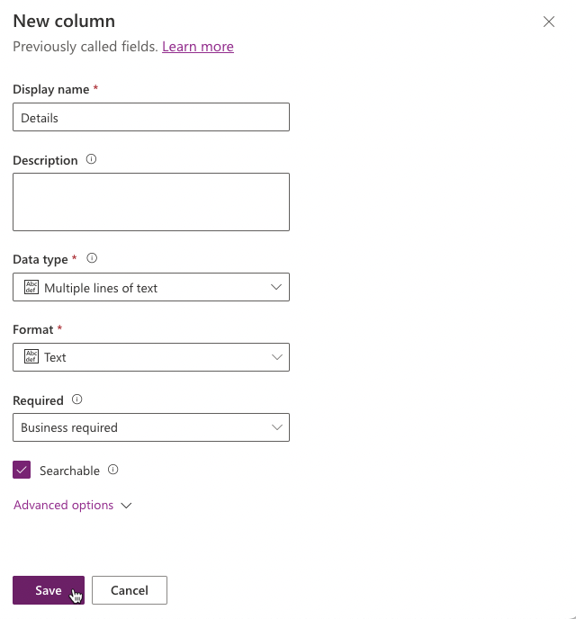

9.  Click **+ New > Column** again.
10.  Enter **Photo** for **Display name**, select **File > Image** for **Data type**, and click **Save**.
11.  Click **+ New > Column**.
12.  Enter **Resolution** for **Display name**, select **Text > Multiline text > Plain Text** for **Data type**, and click **Save**.
13.  Click **+ New Column**.
14.  Enter **Resolved On** for **Display name**, select **Date and time** for **Data type**, and click **Save**. Select the **Back** from the top menu option.
15.  Select **All** in the **Objects** navigation tree.
16.  Click **Publish all customizations** and wait for the publishing to complete.

> **IMPORTANT**
>
> Do not navigate away from this page until all customizations have been published successfully.

#### Task 3: Edit Status Reason Choice

In this task, you will edit the Status Reason column of the Problem Report table.

1.  Make sure you are in the **Company 311** solution.

2.  In the **Objects** navigation tree expand **Tables**, expand **Problem Report**, select **Columns**. Locate and click **Status Reason** column.

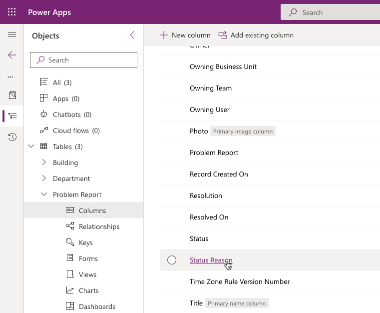

3.  Change the label of **Active** option to **New**.

4.  Click **+ New choice** and enter **Assigned** for **Label**.

5.  Click **+ New choice** and enter **In Progress** for **Label**.

6.  Click **+ New choice** and enter **Completed** for **Label**.

7.  Click **+ New choice** and enter **Won’t Fix** for **Label** and click **OK**.

8.  You should now have 5 options. Select **New** for **Default choice** and click **Save**.

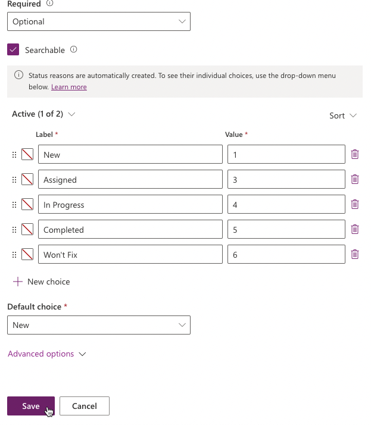

9. Select **All** in the **Objects** navigation tree.
10. Click **Publish all customizations** and wait for the publishing to complete.

#### Task 4: Relationships

In this task, you will create many-to-one relationships between the Problem Report table and the Building and Department tables.

1.  In the **Objects** navigation tree expand **Tables**, expand **Problem Report** table.

2.  Click **+ New > Relationship > Many-to-one** menu.

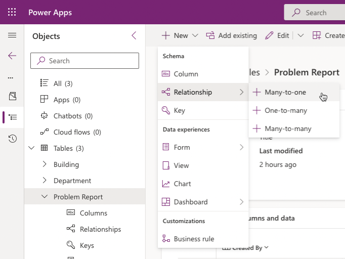

4.  Select **Building** for **Related (One)** table and click **Done**.

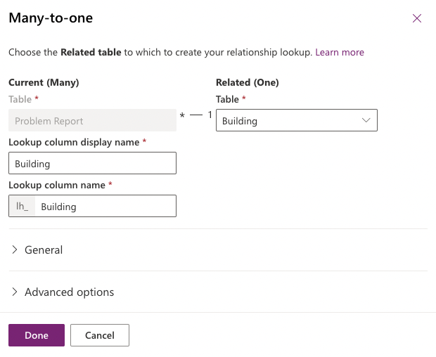

5.  Click **+ New > Relationship > Many-to-one** menu again.

6.  Select **Department** for **Related (One)** table and click **Done**.

7.  Select **All** in the **Objects** navigation tree.

8.  Click **Publish all customizations** and wait for the publishing to complete.

### Exercise 3: Configure form and views

In this exercise, you will configure form and views for the Problem Report table.

#### Task 1: Configure form

1.  Navigate to the [Power Apps maker portal](https://make.powerapps.com/) and make sure you are in the correct environment.

2.  Select Solutions and click to open the **Company 311** solution.

3.  In the **Objects** navigation tree expand **Tables**, expand **Problem Report** table.

4.  Select the **Forms** tab and click to open the **Information** form of type **Main**.

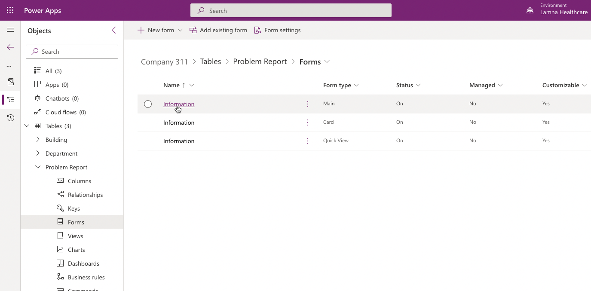

5.  Use the Zoom control at the bottom of the form to make the form large enough for you to work easily. Select the **General** form section.

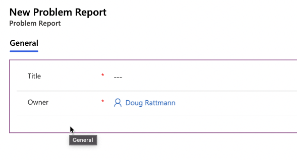

6.  Go to the **Properties** pane, change the **Label** to **Problem details**, and enter **section\_problem\_report** for **Name**.

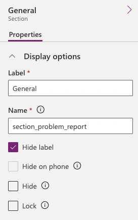

7.  While you still have the section selected, go to the **Table Columns** pane, and click on the **Building** Column. The Building Column will be added to the form.

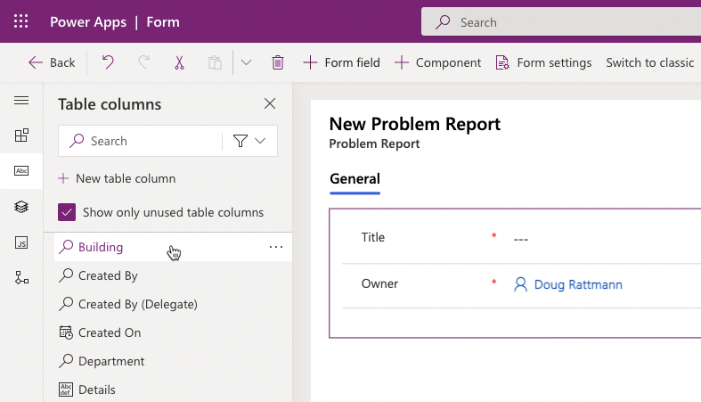

8.  Add the **Details**, and **Photo** Columns to the form.

9.  Your form should now look like the image below. Select the **Details** Column.

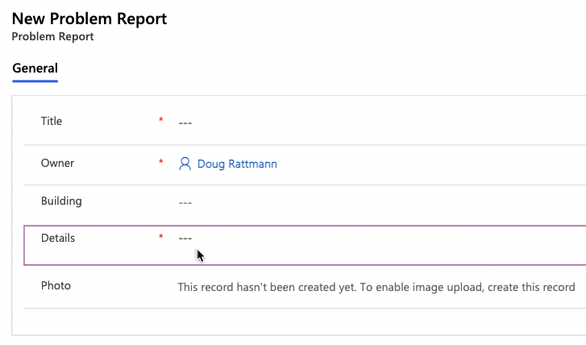

10. Go to the **Properties** pane and expand the **Formatting** section.

11. Change the **Form field height** to **4 rows**.

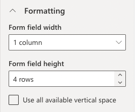

12. Select the **+ Component** from the menu then select **1-column section**.

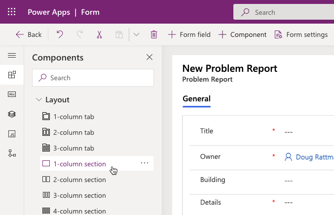

14. A new section should be added to the form. Select the **New Section**.

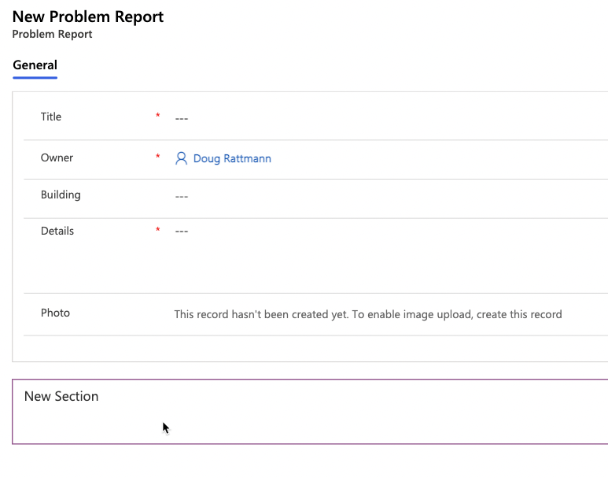

15. Go to the **Properties** pane, change the **Section label** to **Resolution details**, and enter **section\_resolution\_details** for **Name**.

16. Select **Table columns** from the toolbar.

16. Add **Department**, **Status Reason**, **Resolved on**, and **Resolution** columns to the **Resolution details** section.

18. Select the **Resolution** Column.

19. Go to the **Properties** pane and click to expand the **Formatting** section.

20. Change the **Form field height** to **4 rows**.

21. You form should now look like the image below. Click **Save**.

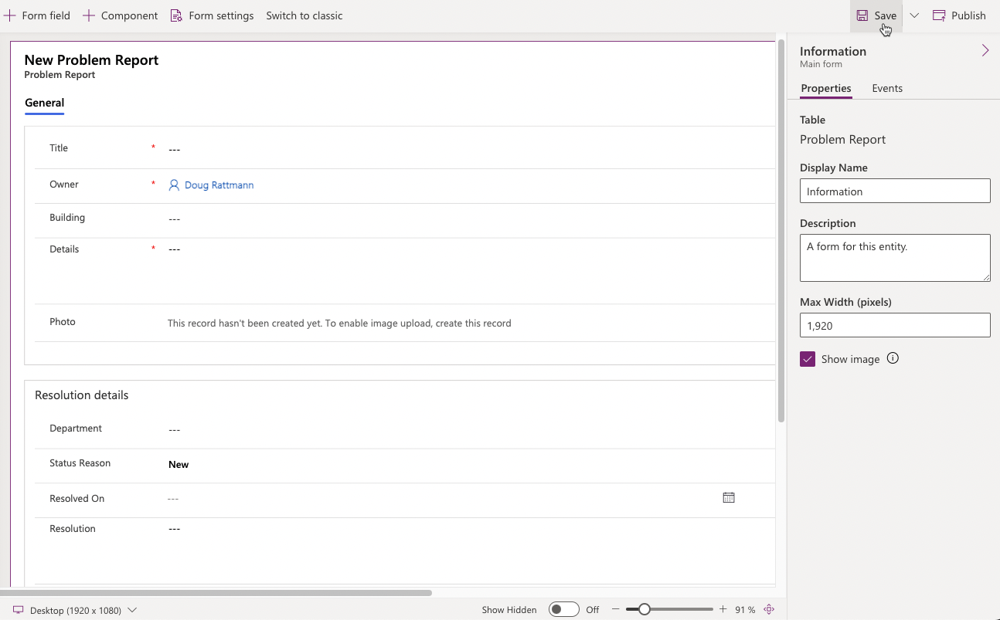

22. Click **Publish** and wait for the publishing to complete.

23. Click on the **<- Back** button.

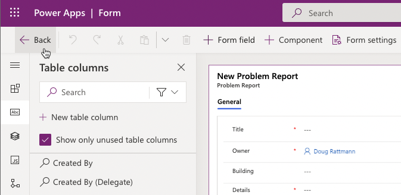

24. You should be back at the table designer screen.

#### Task 2: Edit view

1.  Select **Forms** under **Problem Report** entry, then click **Views**.

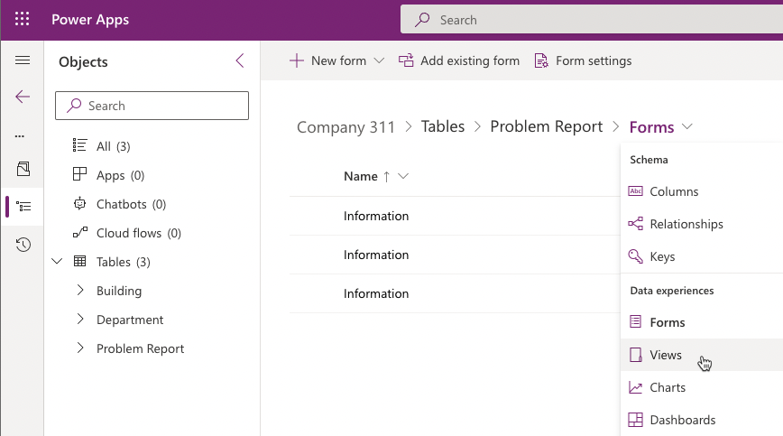

2. Click to open the **Active Problem Reports** view.

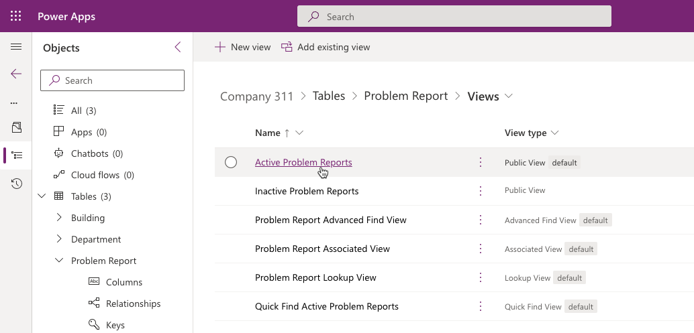

3. Click on **Building** in the **Table columns** list to add the **Building** column to the view.

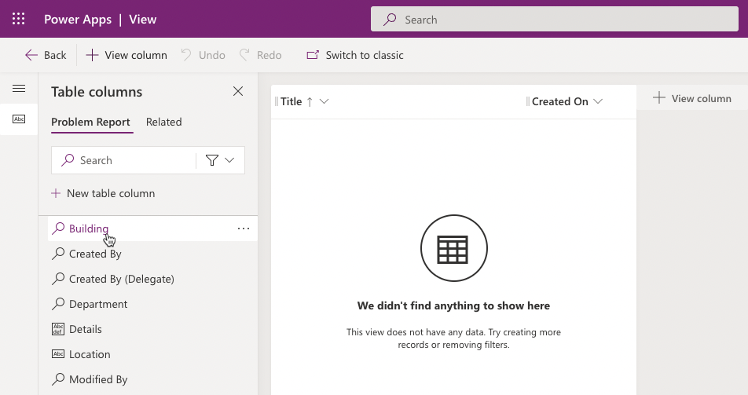

4. Click on **Location**, **Status Reason**, and **Owner** columns to add them to the view.
5. Go to the view properties pane and click **Edit filters**.

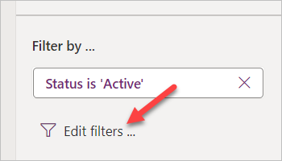

6. Change the existing filter and set it to **Status Reason Equals New**.

 

7. Expand the values dropdown with Status Reason values where **New** is selected.
8. Select **Assigned**.
9. Click on the dropdown again and select **In progress**.
10. The filter should now look like the image below. Click **OK**.

9. Click **Save**.

#### Task 3: Create view from existing

In this task, you will create a new view from the Active Problem Reports view.

1.  Click **Edit filters**.

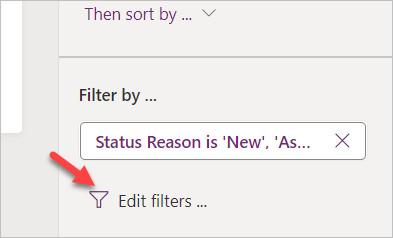

2.  Remove **In Progress** from the filter.

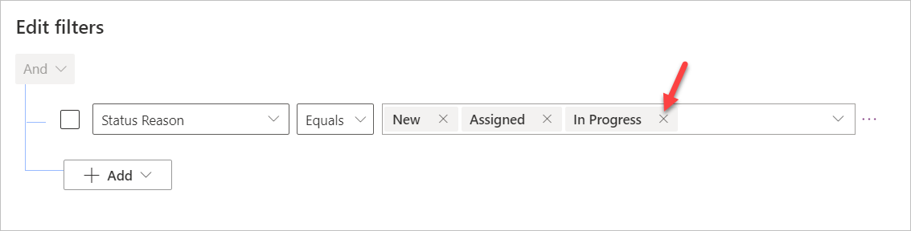

3.  Remove **Assigned**, then remove **New** value form the filter.

4.  Select the dropdown list, then select **Completed**.

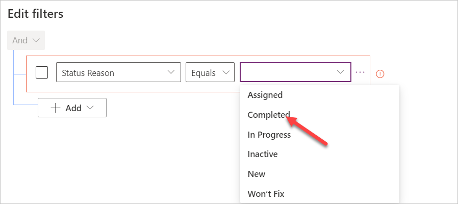

5.  Add **Won’t Fix** and **Inactive** values to filter.

6.  The filter should now look like the image below. Click **OK**.

7.  Click on the chevron button next to the save button and select **Save As**.

8.  Enter **Resolved Problems** for **Name** and click **Save**.

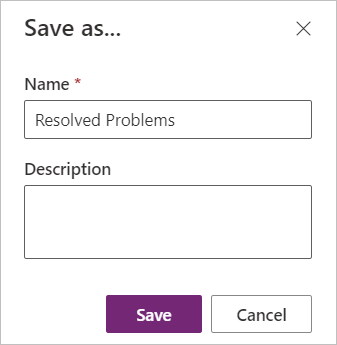

9.  Click on the **Back Button** of your browser to go back to the solution explorer.

10. Select **All** in the **Objects** navigation tree.
11. Click **Publish all customizations** and wait for the publishing to complete.

### Exercise 4: Compose model-driven application

In this exercise, you will create model-driven application.

#### Task 1: Create new model-driven application

1.  Navigate to the [Power Apps maker portal](https://make.powerapps.com/) and make sure you are in the correct environment.

2.  Select Solutions and click to open the **Company 311** solution.

3.  Click **+ New > App > Model-driven app**.

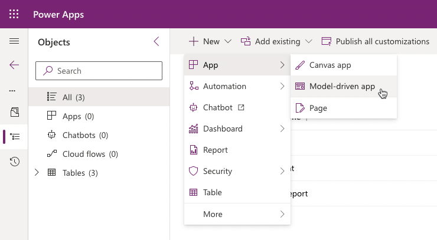

4.  Enter **Company 311 Admin** for name and click **Create**.

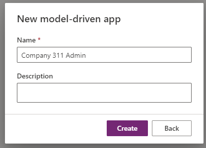

6. Select **Navigation** from left menu.

   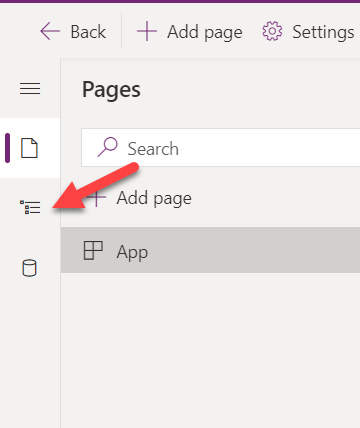

7. Select the **Area1**.

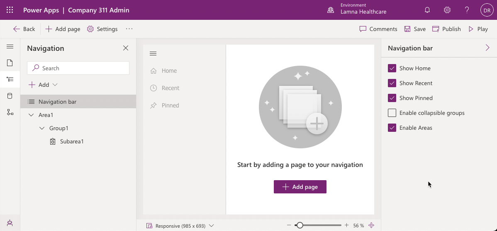

> **TIP**
> 
> Make sure **Enable Areas** option has been been checked in the **Navigation bar** panel on the right-hand side to see the **Area1** entry.

8. Go to the **Properties** pane, enter **Manage Problems** for **Title**, and enter **area\_manage\_problems** for **ID**.

9. Select the **Group1**.

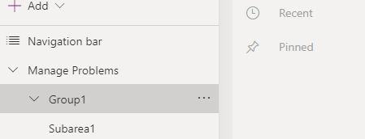

10. Go to the **Properties**, enter **Problems** for **Title**, and enter **group\_problems** for **ID**.
11. Select the **Subarea1** in the tree navigation.
12. Go to the **Properties** pane, select **Table** for **Content Type**, and select **Problem Report** for **Table**, and enter **Problem reports** for **Title**.

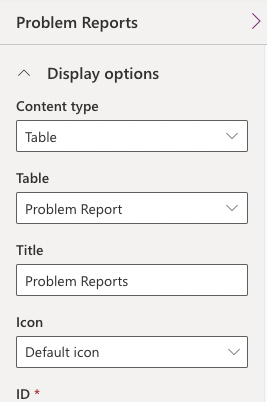

13. Click **+ Add** and select **Area**.

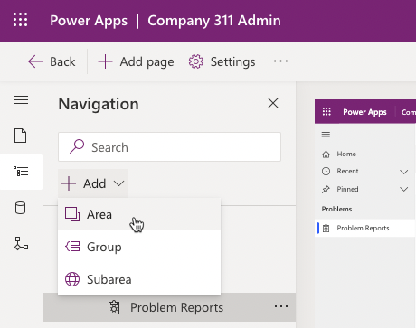

18.   Go to the **Properties** pane, enter **Settings** for **Title**, and enter **area\_settings** for **ID**.

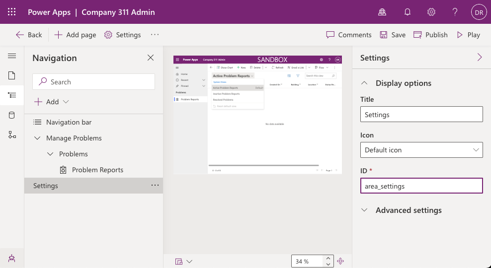

20.  Click **+ Add** and select **Group**.

25.  Select the **New Group** you just added.

26.  Go to the **Properties** pane, enter **Taxonomy** for **Title**, and enter **group\_taxonomy** for **ID**.

27.  Select the **Taxonomy** group you just added, click **+ Add** and select **Subarea**

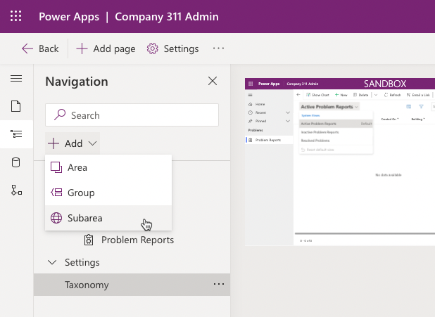

28.   Select **Table** for **Content type**, **Building** for **Table** and click **Add**.

29.  Select the **Taxonomy** group, click **+ Add** and select **Subarea** again.

30.  Select **Table** for **Content type**, select **Department** for **Table**, and click **Add**.

31. The sitemap should now look like the image below. Click **Save** to save the sitemap.

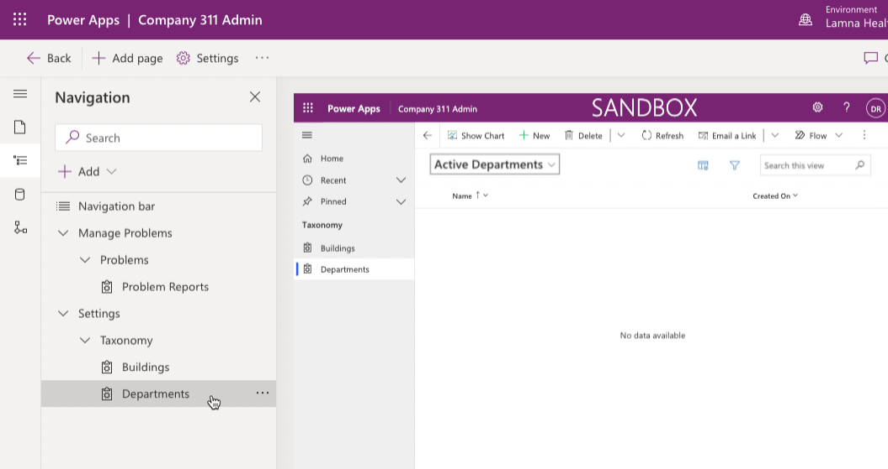

32. Click **Publish** to publish the sitemap and wait for the publishing to complete.
33. Press **<- Back** button.
36. Click **Publish all customizations** and wait for the publishing to complete.

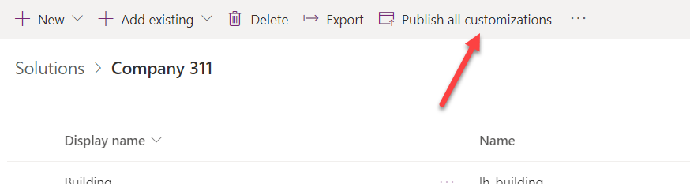

### Exercise 5: Input data

In this exercise, you will input data to the Dataverse tables.

#### Task 1: Input data

1.  Navigate to the [Power Apps maker portal](https://make.powerapps.com/) and make sure you are in the correct environment.

2.  Select **Apps** and click to open the **Company 311 Admin** application you created.

3.  Click **Change area**.

4.  Select **Settings** area.

5.  Select **Departments** and click **+ New**.

6.  Enter **Facility Maintenance** for **Name** and click **Save**.

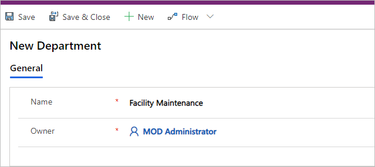

7.  Click **+ New** again.

8.  Enter **Human Resources** for **Name** and click **Save**.

9.  Click **+ New** one more time.

10. Enter **Marketing** for **Name** and click **Save**.

11. Select **Departments**.

12. You should now have three department Rows. Select **Buildings**.

13. Click **+ New**.

14. Enter **San Francisco Main Campus** for **Name** and click **Save & Close**.

15. Click **+ New** again.

16. Enter **London Paddington** for **Name** and click **Save & Close**.

17. You should now have two building Rows. Click **Change area**.

18. Select **Manage Problems**.

19. Click **+ New**.

20. Enter **Broken door** for **Title**, select **San Francisco Main Campus** for **Building**, enter **The main entrance door will not open all the way** for **Details**, and click **Save**

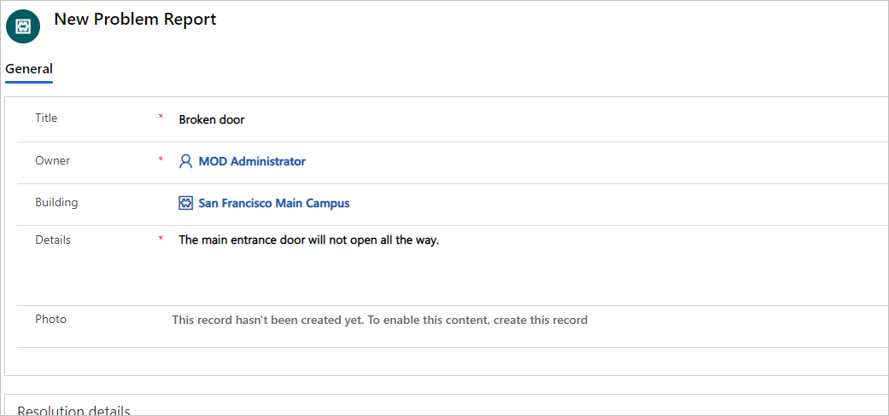

21. Click on the **Photo** Column.

22. Select an image from your device. The sample image displayed below can be found [here](02-1/media/image89.png).

23. The image should now show on the form.

24. Click **Save & Close**.

### Exercise 6: Import data

In this exercise, you will import sample data into the environment. Rows are imported by a Power Automate cloud flow that you will first import using a solution.

#### Task 1: Import solution

1.  Navigate to the [Power Apps maker portal](https://make.powerapps.com/) and make sure you are in the correct environment.
2.  Select **Solutions** and click **Import Solution**.
3.  Click **Browse**.
4.  Select the **DataImport.zip** solution file located in the lab resources folder and click **Open**.
5.  Click **Next**.
6.  Click **Next** again.
7.  Expand **Select a connection** dropdown and click **+ New connection**.
8.  New tab will open with a prompt to create **Microsoft Dataverse** connection. 
9.  Click **Create**, authenticate if required, wait until new connection is created. Close the browser tab.
10.  Click **Refresh**. Make sure new connection is selected in the dropdown. 
11.  Click **Import** and wait for the message **Solution "Data Import" imported successfully** to appear.
12.  Click **Publish all customizations** and wait for the publishing to complete. 

#### Task 2: Review and run flow

1. Click to open the **Data Import** solution you imported.

3.  Select the **Import Data** flow. 

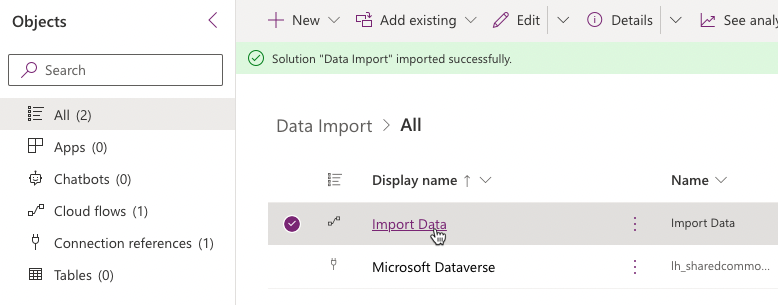

4.  Click **Edit** menu.

5.  Click **Continue**.

6.  Click to expand the **Input** **Data** step.

7.  Review the JSON text in the value Column. This is the data that will be imported into your environment. Note the image data encoded as a text.

8.  Expand the **Each Department** for each control

9.  Expand and review the **Upsert Department** step.

10. Expand and review the rest of the steps.

11. Click **Save** to save the flow.

12. Click on the button and go back to the flow details page.

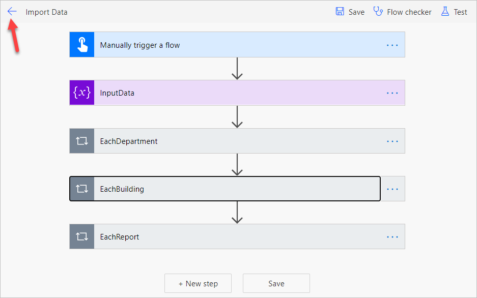

13. Click **Run**.

> **TIP**
>
> If the **Run** option is disabled then make sure the flow has been enabled by selecting the **Turn ON** option.

13. Click **Run flow**.
14. Click **Done**.
15. Wait for the flow run to complete. Click on the **Refresh** button to check if the flow run completed successfully.

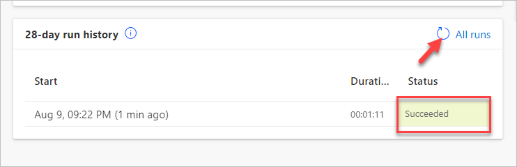

17. Close the flow editor browser window or tab.

18. Click **Done** on the popup if prompted.

#### Task 3: Review imported data

1.  Navigate to the [Power Apps maker portal](https://make.powerapps.com/) and make sure you are in the correct environment.

2.  Select **Apps** and click to open the **Company 311 Admin** model-driven application.

3.  Select Problem Reports. You should see new rows of data.

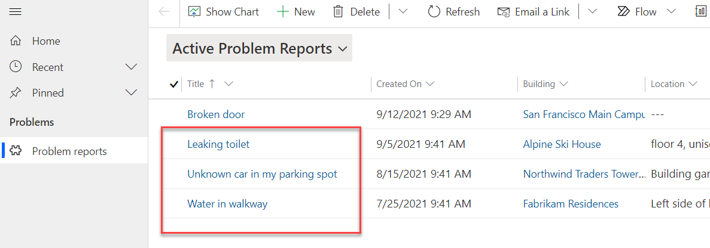

> **NOTE**
>
> Because the input status reason is randomized, some of the imported problem report rows may have the status reason of Completed, Won't Fix, or Inactive. Select **Resolved Problems** view to find these rows.

4.  Click to open one of the **Problem Report** Rows.

5.  Click on the **Search** icon of the **Building** lookup and make sure building Rows were imported.

6.  Scroll down and click on the **Department** lookup.

7.  Make sure the department Rows got imported.

### **Bonus exercise**

  - Deal with problem report assignment within a department.
